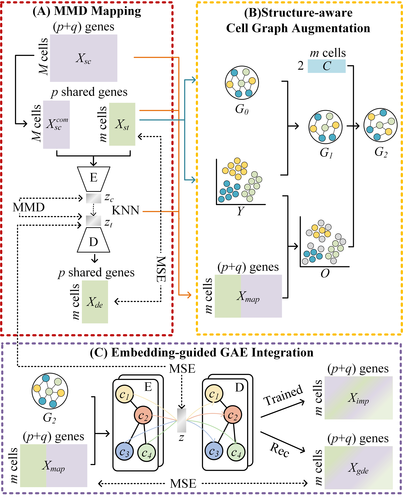

# stMSG, a unified framework that integrates Maximum mean discrepancy (MMD) mapping, structure-aware graph augmentation, and embedding-guided graph autoencoder (GAE) integration.



## Getting Started

### Environment

To get started with stMSG, please follow the steps below to set up your environment:

```bash
git clone https://github.com/lty10086/stMSG
cd stMSG
conda env create -f environment.yaml
conda activate stMSG

### Datasets

All datasets used in this study are publicly available.

- After downloading the data, please refer to the processing steps outlined in Processing.ipynb.
- All processed datasets can be downloaded at [stMSG_Synapse](https://www.synapse.org/Synapse:syn71726608/files/) and [SpaIM_Synapse](https://www.synapse.org/Synapse:syn64421787/files/).

The datasets should be organized in the following structure:
<pre>
|-- dataset
    |-- STdata.h5ad
    |-- scRNAdata.h5ad
</pre>

### SpaIM Testing
Run demo.ipynb and save the results as a .csv file.
